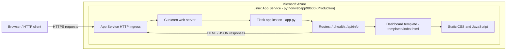
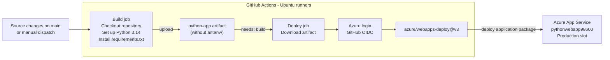

# Architecture

## Application runtime

The Flask app serves the dashboard and its static assets, plus health and
application metadata endpoints. The application has no database or other
external runtime service configured.

## Build and deployment

The deployment workflow is
`.github/workflows/main_pythonwebapp98600.yml`. It uploads the repository
contents as an artifact, excluding the build virtual environment. Azure login
uses OIDC credentials stored as GitHub Actions secrets. The App Service
deployment build behavior depends on the `SCM_DO_BUILD_DURING_DEPLOYMENT`
setting; the workflow comments describe Oryx as the default when that setting
is enabled.
